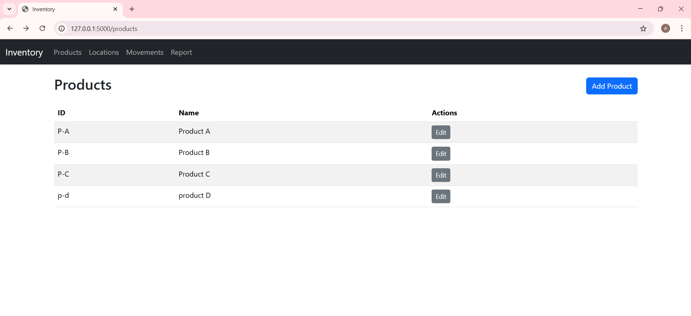
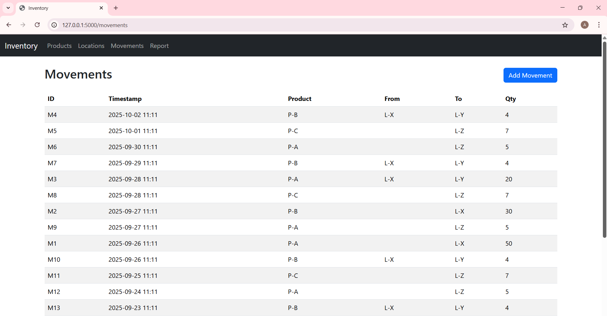
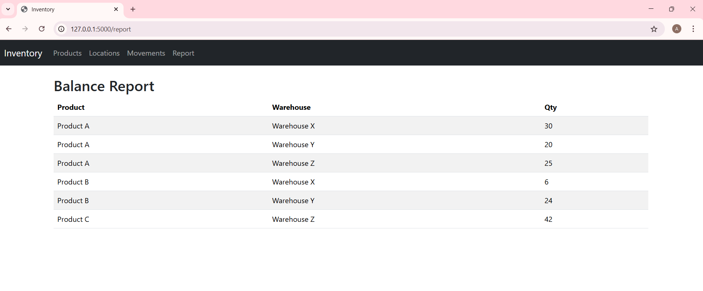
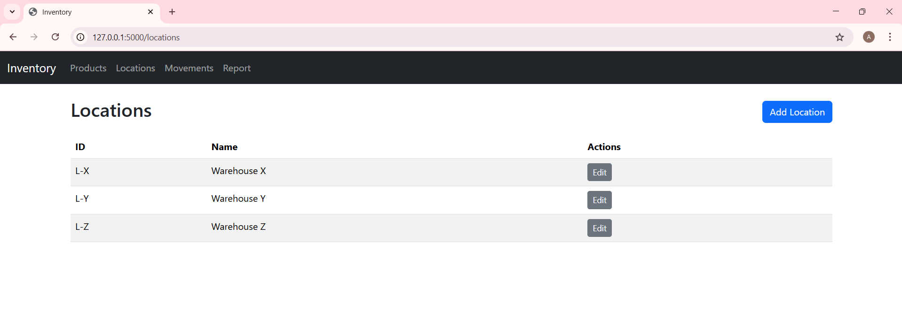

# 🏷️ Inventory Management System

A simple and efficient **Flask-based Inventory Management System** built using **Python** and **SQLite**.  
This project helps manage **products, movements, balances, and locations** through a clean and user-friendly web interface.

---

## 📋 Table of Contents
- [Features](#-features)
- [Modules Overview](#-modules-overview)
- [Project Structure](#-project-structure)
- [Requirements](#-requirements)
- [Installation & Setup](#-installation--setup)
- [Usage](#-usage)
- [Database Schema](#-database-schema)
- [Screenshots](#-screenshots)
- [Future Enhancements](#-future-enhancements)
- [License](#-license)
- [Author](#-author)

---

## 🚀 Features

- ✅ Add, update, and delete product information  
- 🔄 Record stock **movements** (in/out)  
- 📊 Track real-time **inventory balances**  
- 📦 Manage multiple **locations** for storage  
- 🌐 Built with **Flask** for a lightweight web interface  
- 💾 Uses **SQLite** for simple, portable storage  
- 🧠 Easy to understand, extend, and deploy  

---

## 🧩 Modules Overview

| Module | Description |
|--------|--------------|
| **Product** | Manage product details such as name, quantity, and price. |
| **Movement** | Record incoming and outgoing product transactions. |
| **Balance** | Display real-time stock levels and availability. |
| **Location** | Manage warehouse or shelf locations for each product. |

---

## 📁 Project Structure

```

InventoryManagement/
│
├── app.py                 # Main Flask application
├── create_db.py           # Database initialization script
├── requirements.txt       # Dependencies list
├── templates/             # HTML templates for web pages
│   ├── product.html
│   ├── movement.html
│   ├── balance.html
│   └── location.html
├── instance/
│   └── inventory.db       # SQLite database file
├── screenshots/           # Project screenshots
│   ├── balance.png
│   ├── movement.png
│   ├── location.png
│   └── product.png
└── README.md

````

---

## ⚙️ Requirements

- Python 3.7 or above  
- Flask  
- SQLite (bundled with Python)

Install required dependencies using:

```bash
pip install -r requirements.txt
````

---

## 🧰 Installation & Setup

1. **Clone the repository**

   ```bash
   git clone https://github.com/Sivamuthu7979/InventoryManagement.git
   cd InventoryManagement
   ```

2. **Install dependencies**

   ```bash
   pip install -r requirements.txt
   ```

3. **Initialize the database**

   ```bash
   python create_db.py
   ```

4. **Run the application**

   ```bash
   python app.py
   ```

5. **Open your browser**
   Go to 👉 `http://127.0.0.1:5000`

---

## 🖥️ Usage

* Use the **Product** page to add or manage items
* Record stock **Movements** (incoming/outgoing)
* Check stock **Balances** for availability
* Assign or update **Locations** for each product

All data is saved automatically in the SQLite database.

---

## 🧱 Database Schema (Example)

| Column          | Type         | Description           |
| --------------- | ------------ | --------------------- |
| `id`            | INTEGER (PK) | Unique identifier     |
| `product_name`  | TEXT         | Name of the product   |
| `quantity`      | INTEGER      | Available quantity    |
| `location`      | TEXT         | Item storage location |
| `movement_type` | TEXT         | Incoming / Outgoing   |
| `date`          | TEXT         | Transaction date      |

---

## 🖼️ Screenshots

### 🧾 Product Module



### 🔄 Movement Module



### 📊 Balance Module



### 📦 Location Module



---

## 👨‍💻 Author

**Sivamuthu**
💻 [GitHub Profile](https://github.com/Sivamuthu7979)


Would you like me to also add **GitHub badges** (Python, Flask, License, etc.) and a **centered title banner** for a more professional look on your repo front page?
```
